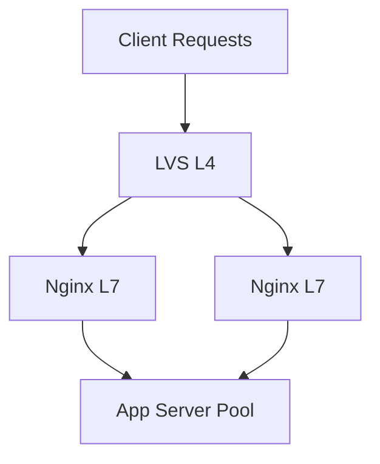
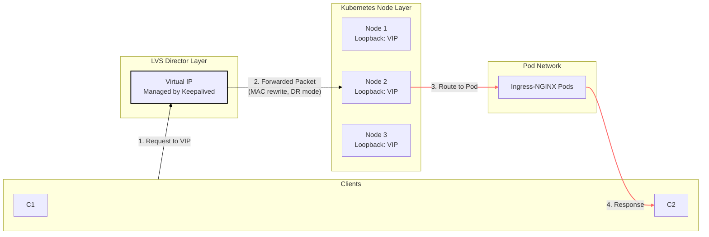

# [**L**inux **V**irtual **S**erver](https://en.wikipedia.org/wiki/Linux_Virtual_Server) (LVS) / [**IP** **V**irtual **S**erver](https://en.wikipedia.org/wiki/IP_Virtual_Server) (IPVS)

Linux Virtual Server (LVS) is a high-performance load balancer, not a caching proxy server like Squid. Its role is to efficiently distribute network requests, while tools like Nginx and Squid focus on application-level features such as caching and content filtering.

To clarify how LVS fits into this ecosystem, here is a comparison of its role relative to other common tools:

| Feature | **Linux Virtual Server (LVS)** | **Nginx (as a reverse proxy)** | **Squid Proxy Server** | **HAProxy** |
| :--- | :--- | :--- | :--- | :--- |
| **Primary Role** | Transport Layer (Layer 4) load balancer | Web/Application Layer (Layer 7) proxy & load balancer | **Forward & caching proxy** | Transport & Application Layer load balancer |
| **Key Strength** | Raw throughput & connection handling | Versatility (load balancing, caching, SSL termination) | **Web content caching & access control** | Advanced Layer 7 logic & health checks |
| **Typical Use Case** | Distributing millions of connections to a server farm | Acting as a front-end for web applications, handling HTTP/HTTPS tasks | **Caching web content to save bandwidth & speed up access** | Complex load balancing for web apps and microservices |
| **Performance Focus** | Kernel-level efficiency, minimal latency | Efficient HTTP handling with some caching | **Optimizing cache hits to reduce external traffic** | High-performance for application-aware routing |

### 🚀 Understanding LVS Performance and Usability

LVS performs exceptionally well in specific areas but has limitations in others.

*   **Performance**: It operates at the kernel level (via the IPVS module), making it extremely efficient for distributing TCP/UDP traffic with minimal overhead. This makes it ideal for handling millions of concurrent connections. A performance evaluation found LVS to be a "viable alternative" to commercial hardware load balancers, offering nearly twice the cost-effectiveness in terms of price/performance.
*   **Usability**: Its main limitation is that it functions primarily at Layer 4. It routes packets based on IP addresses and ports, not on the content of HTTP requests (Layer 7). This means it lacks built-in features for tasks like SSL termination, URL-based routing, or content caching. Configuring and maintaining a high-availability LVS cluster also requires deeper system administration knowledge compared to more application-focused tools.

### 🛠️ How to Choose the Right Tool

Your choice depends entirely on your needs:

*   Choose **LVS** if you need to distribute an **extremely high volume of basic network connections** (e.g., for a large web server, database, or gaming server farm) and are prepared to manage kernel-level configuration.
*   Choose **Nginx** or **HAProxy** if you need an intelligent **application-layer (Layer 7) proxy**. They are better suited for routing based on URLs, managing HTTP headers, terminating SSL, and serving as a single entry point for modern web applications or microservices.
*   Choose **Squid** if your primary goal is to **cache web content, filter user access, or anonymize traffic** on a corporate network, rather than just balancing load.

### 🔄 Typical Deployment Architecture

In practice, these tools are often used together. A common high-performance, scalable architecture uses LVS as the first point of contact to distribute traffic across multiple Nginx or HAProxy servers. These proxies then handle the Layer 7 logic (SSL, routing) before forwarding requests to the final application servers.

This setup combines LVS's raw connection-handling power with the flexibility of application-layer proxies.

In summary, Linux Virtual Server is a specialist tool for high-throughput, low-latency load balancing at the network level. For most proxy-related tasks like caching, content filtering, and intelligent HTTP routing, application-layer proxies like Nginx, HAProxy, or Squid are more suitable and easier to manage.

I hope this clarifies the role of LVS. If you can share more about the specific performance or traffic challenges you're aiming to solve, I may be able to offer more targeted guidance.

## Q:

We currently use HAProxy and Keepalived as the edge to the upstream Kubernetes cluster, with HAProxy operating in TCP mode, effectively creating an HA external load balancer for the cluster that handles node-level failover. Is LVS a viable replacement?

## A:

**Yes, LVS can be a viable and potentially higher-performance replacement for your HAProxy (TCP mode) + Keepalived setup**, as it directly replicates their core function. Your current stack uses Keepalived to manage a Virtual IP (VIP) for high availability and HAProxy in TCP mode for Layer 4 load balancing. LVS with `keepalived` (the same software) does precisely this in a more integrated, kernel-native way.

Here’s a detailed breakdown of what you gain and lose by switching:

### 🔄 Direct Comparison: LVS vs. Your HAProxy (TCP) Setup

| Aspect | **Your Current Setup: HAProxy (TCP mode) + Keepalived** | **Potential Replacement: LVS + Keepalived** |
| :--- | :--- | :--- |
| **Core Function** | User-space TCP load balancer managed by a high-availability daemon. | Kernel-space (**IPVS**) TCP/UDP load balancer managed by the same high-availability daemon. |
| **Performance Profile** | Very good, efficient user-space proxy. | **Excellent, lower latency, higher throughput** due to kernel integration and direct routing modes. |
| **Architecture** | Proxy model: connections terminate at HAProxy, which opens new ones to backends. | **Direct Routing (DR) mode**: packets are forwarded, **backend servers reply directly to client**. More efficient. |
| **Operation Layer** | Transport Layer (Layer 4). | Transport Layer (Layer 4). |
| **High Availability** | Provided by Keepalived (VRRP). | **Identical**: Provided by Keepalived (VRRP). |
| **SSL/TLS Handling** | **Can terminate TLS** (if configured in TCP mode with SSL bindings). | **Cannot process TLS**. SSL termination must happen downstream (e.g., in your Ingress controllers). |
| **Advanced Features** | Rich stats, flexible ACLs, optional HTTP-mode logic. | Focused purely on load balancing; stats and logic are more basic. |

### ✅ Advantages of Switching to LVS

1.  **Higher Performance & Lower Latency**: As a kernel module (IPVS), LVS has less overhead than a user-space daemon. In **Direct Routing (DR) mode**, the load balancer forwards packets without terminating connections, allowing backend servers to reply directly to the client. This eliminates the load balancer as a bottleneck for return traffic, dramatically increasing capacity.
2.  **Architectural Simplicity**: You replace two cooperating daemons (HAProxy *and* Keepalived for VIP management) with a more unified model where `keepalived` directly configures the kernel's IPVS tables.

### ⚠️ Critical Considerations & Trade-offs

1.  **Loss of SSL Termination at the Edge**: This is the most significant trade-off. If you rely on HAProxy to **terminate TLS/HTTPS** before traffic reaches Kubernetes, LVS cannot do this. You must move SSL termination into your cluster (e.g., to your Ingress controllers like NGINX Ingress or Traefik).
2.  **More Complex Backend Network Setup**: Direct Routing (DR) mode requires that all your Kubernetes node servers share the same Virtual IP (VIP) as the LVS director. This requires careful loopback interface configuration (`ip addr add`) on each node, which adds deployment complexity compared to the standard proxy model.
3.  **Loss of Application-Layer Features**: You lose HAProxy's rich logging, detailed metrics, and any potential for HTTP-based ACLs or routing. Monitoring becomes about connection counts and packet rates rather than HTTP status codes.

### 🛠️ Recommended Path Forward

**The choice depends heavily on one factor: where you terminate SSL/TLS.**

*   **If you already terminate SSL inside Kubernetes** (at the Ingress controller), then switching to LVS in DR mode is a **strong performance and efficiency upgrade**. Your architecture is already prepared.
*   **If you rely on your edge HAProxy to terminate SSL**, switching to LVS would require a significant architectural change. In this case, the performance gain may not justify the operational overhaul.

**Before deciding, you can validate performance claims** by testing in a non-production environment. A simple two-tier test setup (LVS director -> backend pods) can provide concrete latency and throughput data for your specific traffic patterns.

**Would you be able to clarify where SSL termination happens in your current setup?** This is the key factor that determines the feasibility and value of replacing HAProxy with LVS.

---

## Q:

HAProxy proxies both control and dataplane in TCP mode (TLS-passthrough) with PROXY protocol on the data plane. Connectivity to Ingress is by the "self-provisioned edge device" method of ingress-nginx for "baremetal" (on-prem) deployments, which is at NodePorts on each node. Keepalived in VRRP mode manages the vIP binding to the MASTER node.

## A:

Your detailed architecture clarifies that **LVS is not just viable, but a near-perfect and high-performance replacement for your current setup.**

You are using HAProxy in a pure Layer 4, TLS-passthrough mode with PROXY protocol. This is *exactly* the type of traffic pattern LVS and its IPVS kernel module are designed to handle most efficiently.

### ✅ How LVS Maps to Your Current Architecture

| Your Current Component | LVS Equivalent & Analysis |
| :--- | :--- |
| **HAProxy (TCP Mode)** | **IPVS (LVS Kernel Module)**. Both perform stateless Layer 4 load balancing. |
| **TLS Passthrough** | **Fully Supported**. LVS forwards encrypted TLS packets unchanged, just like HAProxy. |
| **PROXY Protocol** | **Natively Supported**. The IPVS `ip_vs_ftp` module and standard configurations handle PROXY protocol v1/v2 for preserving client IPs when forwarding to your ingress-nginx NodePorts. |
| **Keepalived (VRRP)** | **Identical**. You would use the same `keepalived` daemon to manage the VIP and failover. The configuration simply changes from managing HAProxy to managing IPVS rules. |
| **Upstream to NodePorts** | **Identical**. LVS would balance traffic across the same pool of Kubernetes node IPs and their NodePorts. |

### 🚀 The Key Advantage: Performance & Efficiency with Direct Routing

The most compelling reason to switch is the ability to use **LVS in Direct Routing (DR) mode**. Here's why it's superior to your HAProxy proxy mode:

*   **Your Current Flow (HAProxy Proxy Mode)**:
    1.  Client connects to the VIP on HAProxy.
    2.  HAProxy terminates the TCP connection.
    3.  HAProxy opens a new TCP connection to a backend Kubernetes node (NodePort).
    4.  All data passes through HAProxy twice (inbound and outbound), making it a bottleneck for throughput and latency.

*   **Proposed Flow (LVS Direct Routing Mode)**:
    1.  Client connects to the VIP on the LVS director.
    2.  LVS *rewrites the destination MAC address* of the incoming packet to a chosen backend node and forwards it **without terminating the TCP connection**.
    3.  The backend node (with the VIP configured on a loopback interface) receives the packet, processes it, and **sends the response directly back to the client**.
    4.  The LVS director handles **only inbound** traffic. The return traffic bypasses it entirely, massively increasing scalability and reducing latency.

### 📋 Migration Checklist & Key Considerations

Switching is conceptually straightforward but requires careful network configuration:

1.  **Backend Node Configuration (Most Critical)**: Each Kubernetes node must have the LVS Virtual IP configured on a loopback interface (e.g., `lo:1`). This is done with a command like `ip addr add <VIP>/32 dev lo label lo:1`. You must also configure the nodes to **ignore ARP requests** for the VIP on their physical interfaces (using `arp_ignore` and `arp_announce` sysctls). This is typically handled by a DaemonSet in Kubernetes deployments.
2.  **Health Checks**: Ensure your `keepalived` configuration uses effective health checks (like TCP check to the NodePort) to remove unhealthy nodes from the IPVS pool.
3.  **PROXY Protocol Configuration**: When defining your IPVS real servers (the backend nodes), you must ensure the service is configured to forward the PROXY protocol header. This is often a flag in the `keepalived` config for the virtual server.

### ⚖️ Final Recommendation

**For your specific on-prem, TLS-passthrough, NodePort-based architecture, replacing HAProxy+Keepalived with LVS+Keepalived is a strong technical upgrade.**

**You should consider making the switch if:**

*   You are experiencing performance bottlenecks or latency at the edge load balancer.
*   You anticipate significant growth in traffic volume.
*   You have the operational capability to manage the initial backend node network configuration (which can be automated with a DaemonSet).

**Your current setup is perfectly fine and simpler to manage if:**

*   Your performance is satisfactory and growth is stable.
*   You have minimal operational bandwidth for changes.

**Next Steps:** To proceed, you would:

1.  Develop an automation (Ansible playbook, DaemonSet) to configure the `arp_ignore/arp_announce` sysctls and the loopback VIP on your Kubernetes nodes.
2.  Write the new `keepalived.conf` that defines the IPVS virtual server and real server pool.
3.  Test failover and performance in a staging environment that mirrors your network topology.

Would you like a sample `keepalived.conf` configuration snippet for an IPVS setup that mirrors your current HAProxy service?

---

<!-- 

… ⋮ ︙ • ● – — ™ ® © ± ° ¹ ² ³ ¼ ½ ¾ ÷ × ₽ € ¥ £ ¢ ¤ ♻ ⚐ ⚑ ✪ ❤  \ufe0f
☢ ☣ ☠ ¦ ¶ § † ‡ ß µ Ø ƒ Δ ☡ ☈ ☧ ☩ ✚ ☨ ☦ ☓ ♰ ♱ ✖  ☘  웃 𝐀𝐏𝐏 🡸 🡺 ➔
ℹ️ ⚠️ ✅ ⌛ 🚀 🚧 🛠️ 🔧 🔍 🧪 👈 ⚡ ❌ 💡 🔒 📊 📈 🧩 📦 🥇 ✨️ 🔚

# Markdown Cheatsheet

[Markdown Cheatsheet](https://github.com/adam-p/markdown-here/wiki/Markdown-Cheatsheet "Wiki @ GitHub")

# README HyperLink

README ([MD](__PATH__/README.md)|[HTML](__PATH__/README.html)) 

# Bookmark

- Target

- Reference
[Foo](#foo)

-->
